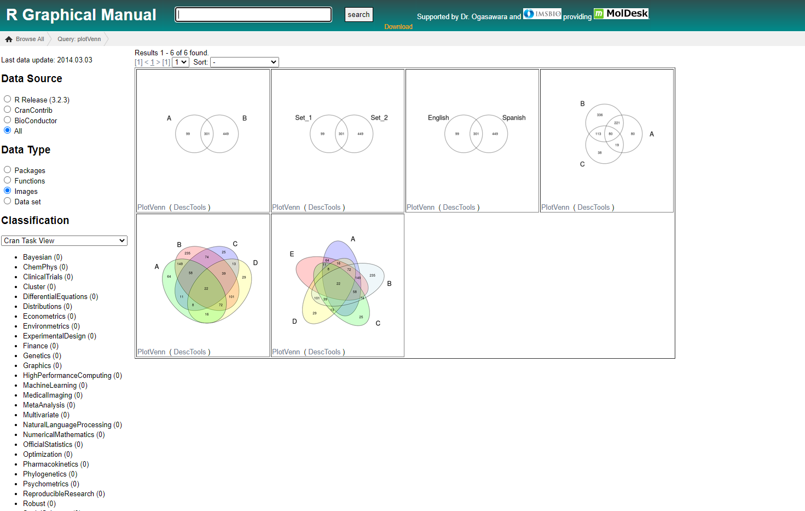

# Rを用いた解析環境構築

R では、bioconductor というデータ解析と可視化に特化したライブラリ群が有志によって維持されています。


### Bioconductorを使用するための準備

```r
source("https://bioconductor.org/biocLite.R")
biocLite()
```

### ライブラリのインストール

```r
biocLite("affy")
library(affy)
```


### R-Graphical-Manual

R-Graphical-Manualでは、可視化された図の一覧からライブラリを探すことができる。  
`plotVenn` というキーワードで調べた例。


